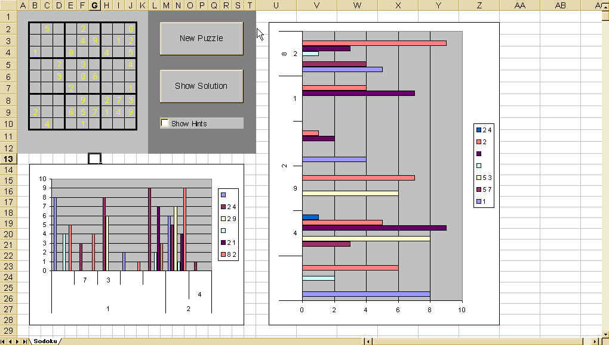



## Sodoku In Excel

### Description

The included Excel spreadsheet is a fully functional Soduku game generator and is playable right on the spreadsheet. If you enable 'hints' it will show you when you enter a bad value.

The charts are there as 'boss candy' just in case you want to play a game - and look like you are doing work!

I have previously released this as freeware on www.download.com. (I am 'Lyrical Software')

Feel free to use the source code (that's why it is posted here).
 
### More Info
 

             |
---                |---
**Submitted On**   |2006-06-12 09:37:28
**By**             |[Dave Andrews](https://github.com/Planet-Source-Code/PSCIndex/blob/master/ByAuthor/dave-andrews.md)
**Level**          |Intermediate
**User Rating**    |5.0 (15 globes from 3 users)
**Compatibility**  |VBA MS Excel
**Category**       |[Games](https://github.com/Planet-Source-Code/PSCIndex/blob/master/ByCategory/games__1-38.md)
**World**          |[Visual Basic](https://github.com/Planet-Source-Code/PSCIndex/blob/master/ByWorld/visual-basic.md)
**Archive File**   |[Sodoku\_In\_2000466122006\.zip](https://github.com/Planet-Source-Code/dave-andrews-sodoku-in-excel__1-65646/archive/master.zip)

